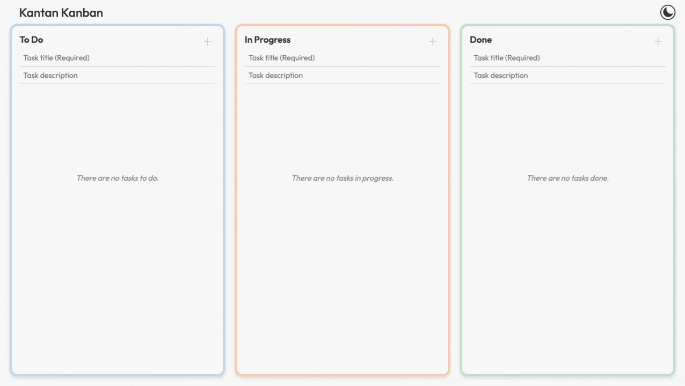
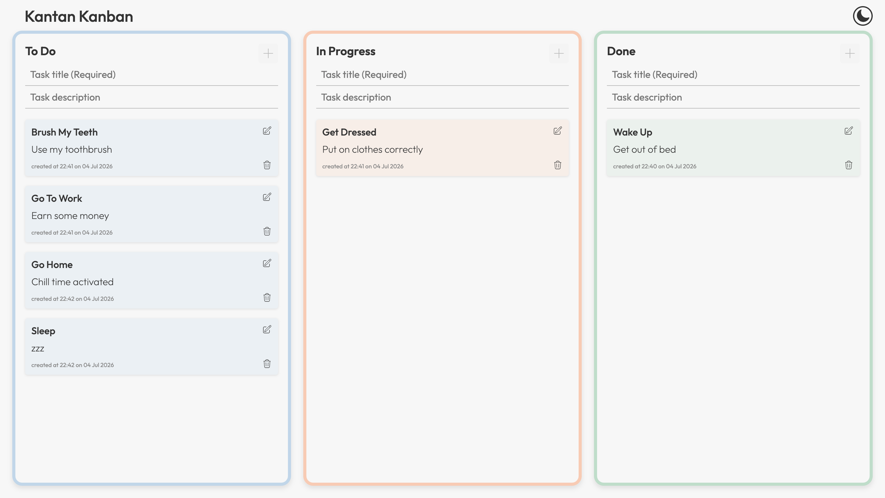
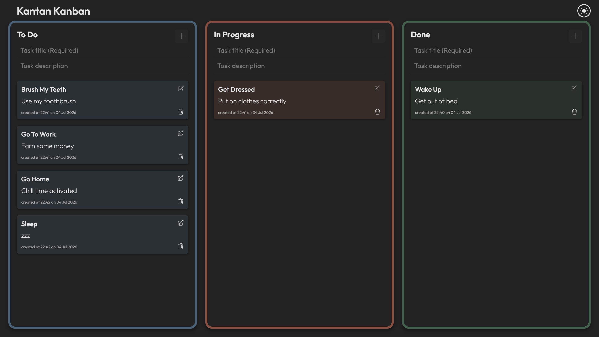
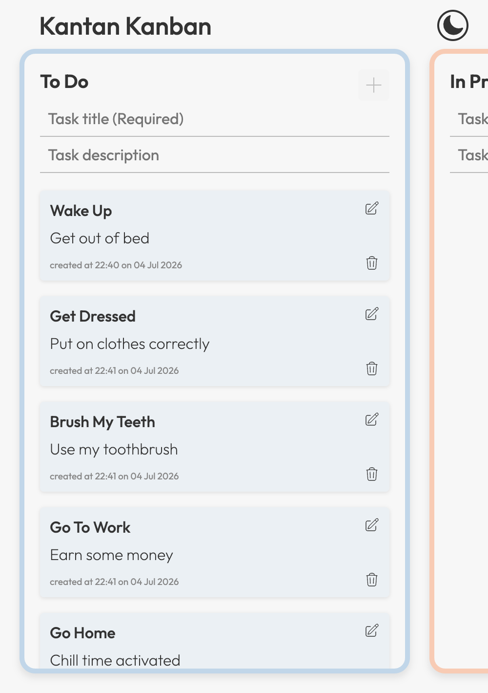

# Kantan Kanban




A lightweight Kanban-style task management application built with **React** and **Vite**.

This project was created to strengthen my understanding of React component architecture, state management, drag-and-drop interactions, and browser storage while building a clean, responsive application with a focus on usability.

## 🌐 Live Demo

[](https://kantankanban.netlify.app/)

---

## 📋 Table of Contents

- [Overview](#-overview)
- [Key Skills Demonstrated](#-key-skills-demonstrated)
- [Features](#-features)
- [Technologies Used](#-technologies-used)
- [Getting Started](#-getting-started)
- [What I Learned](#-what-i-learned)
- [Challenges](#-challenges)
- [Future Improvements](#-future-improvements)
- [Screenshots](#-screenshots)

---

## 📌 Overview

Kantan Kanban is a lightweight task management application inspired by the Kanban workflow.

Users can create, edit, delete, and organise tasks by dragging them between workflow columns. Tasks are automatically saved using `localStorage`, allowing progress to persist between browser sessions.

Alongside the core functionality, I focused on creating a polished user experience through responsive design, accessibility improvements, dark mode support, confirmation dialogs, and other usability enhancements.

---

## 💪 Key Skills Demonstrated

- React component architecture
- State management with React Hooks
- Drag-and-drop functionality
- Data persistence using `localStorage`
- Responsive web design
- Accessibility best practices
- Reusable component design
- User experience (UX) enhancements

---

## ✨ Features

- Create, edit, and delete tasks
- Drag and drop tasks between workflow columns
- Automatically save tasks using `localStorage`
- Dark mode with saved user preference
- Responsive layout for desktop and mobile devices
- Task creation timestamps
- Delete confirmation dialog
- Tooltips for improved usability
- Accessibility improvements using ARIA labels
- Optional vibration feedback on supported mobile devices

---

## 🛠 Technologies Used

- React
- Vite
- JavaScript (ES6+)
- HTML5
- CSS3
- @hello-pangea/dnd
- React Icons
- React Tooltip

---

## 🚀 Getting Started

### Clone the repository

```bash
git clone https://github.com/adameasom/Kantan-Kanban.git
```

### Navigate to the project directory

```bash
cd Kantan-Kanban
```

### Install dependencies

```bash
npm install
```

### Start the development server

```bash
npm run dev
```

---

## 📚 What I Learned

Building this project helped me strengthen my understanding of:

- Structuring React applications into reusable components
- Managing application state with React Hooks
- Integrating third-party libraries into a React application
- Persisting application data using `localStorage`
- Creating responsive layouts for different screen sizes
- Improving accessibility through semantic HTML and ARIA attributes
- Enhancing the user experience with thoughtful interface design

---

## 🧩 Challenges

One of the most interesting challenges was implementing drag-and-drop functionality while keeping the application state organised and ensuring task changes were correctly persisted to `localStorage`.

Another challenge was adding features such as dark mode, accessibility improvements, tooltips, and confirmation dialogs while keeping the codebase modular and maintainable.

---

## 🔮 Future Improvements

Potential future enhancements include:

- Task priorities
- Due dates and reminders
- Labels or categories
- Search and filtering
- Multiple Kanban boards
- User authentication
- Cloud data storage
- Keyboard shortcuts for improved accessibility

---

## 📷 Screenshots

### Desktop



### Dark Mode



### Mobile


